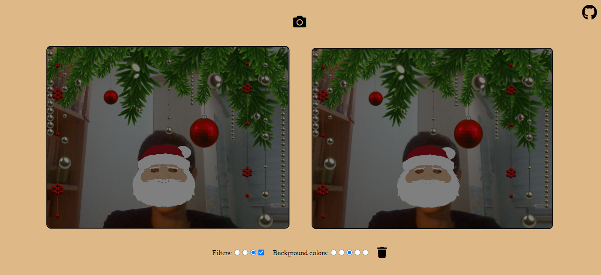

# 📷 Snapchat Filters on WebCam
Detects your face and adds filters from your webcam. You can capture and download images.

👉 [Visit site](https://snapchat-filters-on-webcam.netlify.app/)

## 📌 Screenshots
</img>

</img>

## 💻 Used Technologies
* CSS / SCSS
* JavaScript / p5.js

## ☑️ Todo
* [ ] Add more filters and backgrounds.

## 📚 Resources
* [p5.js](https://github.com/processing/p5.js)
* [clmtrackr](https://github.com/auduno/clmtrackr)
* [CodePen](https://codepen.io/livecodestream/pen/rNxrMzp)
* [Face Model](img/face-model.webp)

## 📃 License
* This project licensed under the [MIT License](https://github.com/orhanemree/snapchat-filters-on-webcam/blob/master/LICENSE).